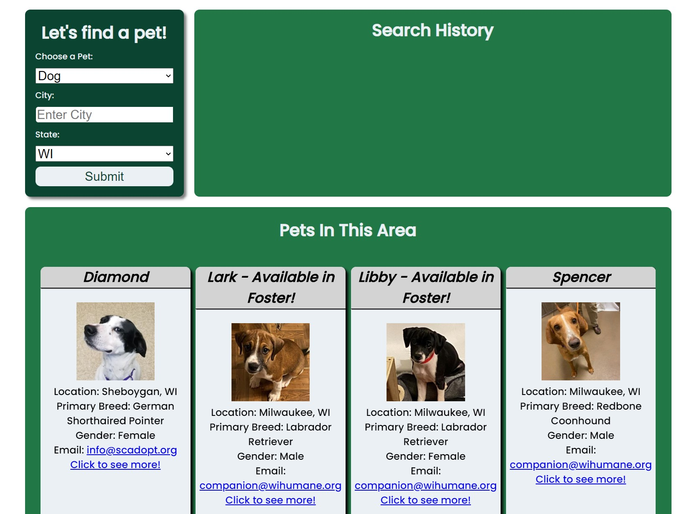

# Pet Mapper

To easily and quickly display nearby pets and display them on a map

Github Repo: https://github.com/kwedwick/pet-mapper
Live URL: https://kwedwick.github.io/pet-mapper/

## Table of Contents

- [Final Product](#Final-Product)
- [Planning](#Planning)
- [Challenges](#Challenges)

## Final Product

Here is the screenshot of the main page

Currently using Petfinder API to display nearby results. In the future will look to expand to incorporating other adoption APIs

## Planning

1. Setting up the API we were going to use
2. Diving work up between the two API calls, and styling HTML
3. Getting Glide.js to display results
4. Utilizing the Petfinder API
5. Styling the fields
6. Search Parameters we would allow for now
7. Mobile first

## Challenges

1. Persistent saved results
2. Dragging pet cards for later
3. Linking Petcard to Map marker

